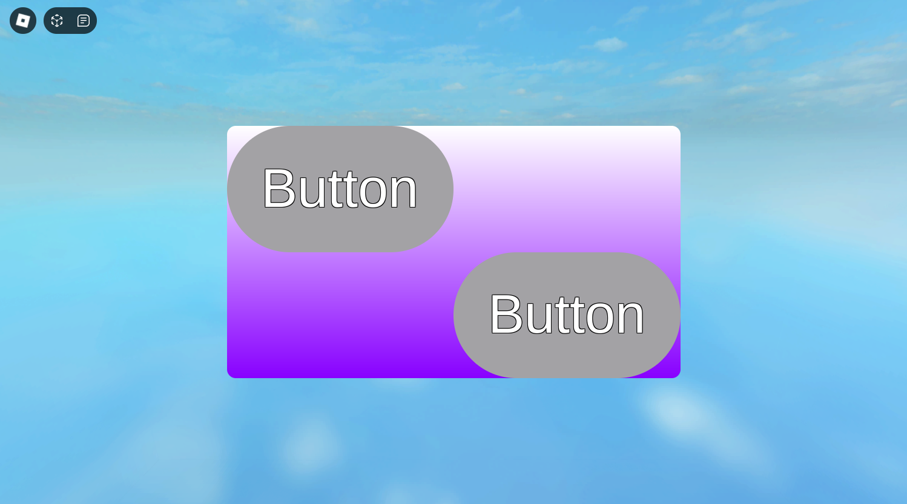

# NeoUI
NeoUI is a strictly-typed Roblox Luau library making it easier to dynamically generate UI.

Also provides some utilities like default properties of gui objects being different than they normally are, for exmaple ScreenGuis have IgnoreGuiInset enabled by default, as most of the time you probably want it to be enabled.

Used by Tower Defense NEO (currently only in the lobby).

# Usage example
```luau
local ReplicatedStorage = game:GetService("ReplicatedStorage")
local NeoUI = require(ReplicatedStorage.NeoUI)

local PlayerGui = game:GetService("Players").LocalPlayer:WaitForChild("PlayerGui")

--Creating a ScreenGui and a Frame
local MainGui = NeoUI.createElement(PlayerGui, "ScreenGui", {
    Name = "MainGui"
})
local Frame = NeoUI.createElement(MainGui, "Frame", {
	Name = "MainFrame",
	BackgroundColor3 = Color3.new(1, 1, 1),
	Position = UDim2.new(0.5, 0, 0.5, 0),
	AnchorPoint = Vector2.new(0.5, 0.5),
	Size = UDim2.new(0.5, 0, 0.5, 0),
	ZIndex = 1
}, {
	UICorner = {CornerRadius = UDim.new(0, 15)},
	UIGradient = {
		Color = ColorSequence.new(Color3.new(1, 1, 1), Color3.fromRGB(136, 0, 255)),
		Rotation = 90
	}
})

--Creating TextButtons from a template
local TextTemplate = NeoUI.createTemplate("TextButton", {
	Position = UDim2.new(0.5, 0, 0.5, 0),
	AnchorPoint = Vector2.new(0, 0),
	Size = UDim2.new(0.5, 0, 0.5, 0),
	TextColor3 = Color3.new(1,1,1),
	TextStrokeTransparency = 0,
	ZIndex = 2
}, {
	UICorner = {CornerRadius = UDim.new(0.5, 0)}
})

local Button1 = NeoUI.createFromTemplate(Frame, TextTemplate, {
	Name = "Text1"
})
Button1.Activated:Connect(function()
	print("Activated Button1")
end)
local Button2 = NeoUI.createFromTemplate(Frame, TextTemplate, {
	Name = "Text2",
	AnchorPoint = Vector2.new(1,1)
})
Button2.Activated:Connect(function()
	print("Activated Button2")
end)
```
<div align="center">
	
</div>

# Why not React-lua?
I don't know, I just never felt like using it. Instead I decided to make a custom library specifically for my game.
It's meant to be easy to use and modify, and I think I have achieved just that.

If you want something more advanced though then you'd most likely want to actually use React-lua, but still you can use NeoUI if you want an easier alternative.
